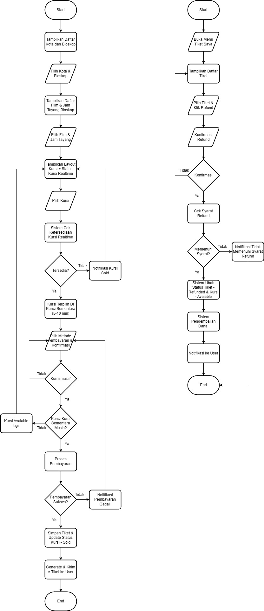
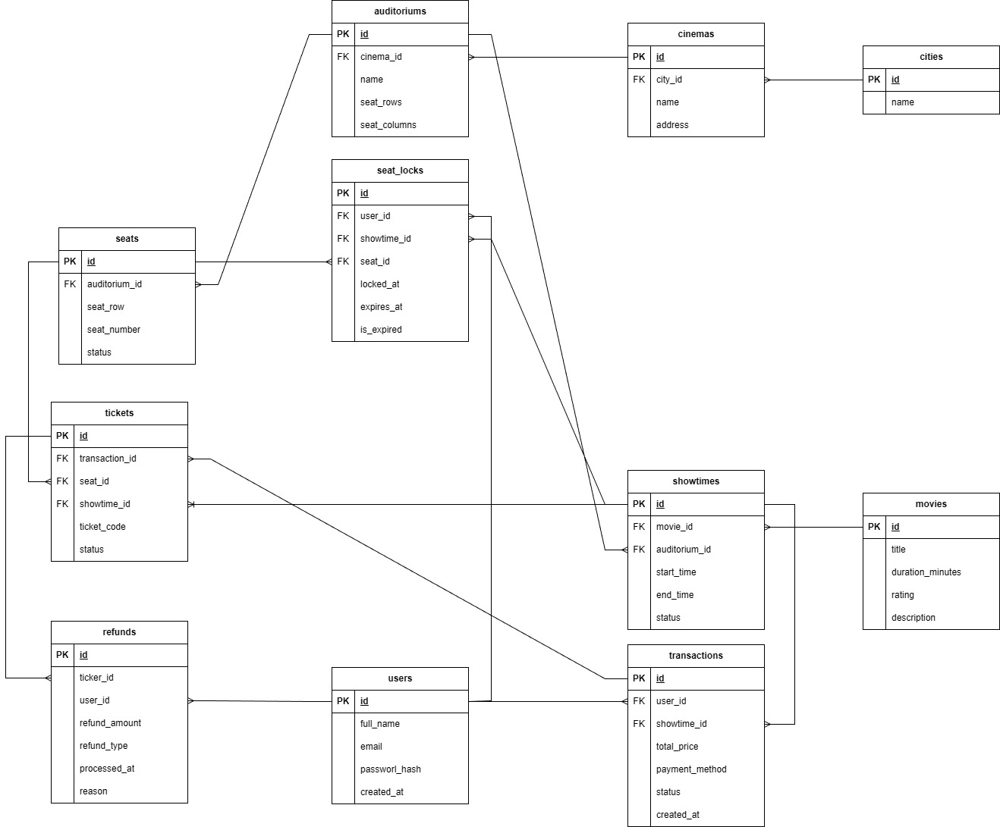

# Go Cinema API

Nama : Dimas AKmal Widi Pradana

## A. System Design Test

### 1️⃣ Flowchart Sistem



### 2️⃣ Pemilihan Kursi, Restok Tiket & Refund

### 2️⃣ Pemilihan Tempat Duduk, Restok Tiket & Refund

**Solusi Pemilihan Kursi (High Performance & Aman dari Double Booking)**

-   Masalah: Banyak user bisa klik kursi yang sama dalam milidetik → tidak boleh double booking.
-   Solusi: **Seat Lock / Temporary Reservation**
    -   Saat user pilih kursi, sistem cek AVAILABLE → jika tersedia, kursi dikunci ±5 menit.
    -   Lock hilang otomatis jika: pembayaran gagal, waktu habis, atau user batal.
-   Keuntungan: mencegah 2 user mengambil kursi sama, tetap real-time.
-   Performa tinggi: pakai **Redis** (key: `seat:{schedule_id}:{seat_id}` dengan expire 300s)
    -   Alternatif sederhana: row-level lock di DB + `expires_at`.

**Sistem Restok Tiket**

-   Konsep: ketersediaan kursi = stok.
-   Kursi kembali AVAILABLE jika:
    -   Pembayaran gagal
    -   Lock expired
    -   User batal tiket
    -   Admin bioskop membatalkan jadwal

**Refund / Pembatalan oleh Bioskop**

-   Contoh: film batal tayang atau kendala teknis
-   Proses:
    -   Admin cancel jadwal → semua tiket terkait → status SOLD → REFUNDED
    -   Kursi otomatis SOLD → AVAILABLE
    -   Customer menerima dana refund atau voucher

---

## B. Database Design Test

### 1️⃣ ERD / Database Schema



---

## C. Skill Test

### 1️⃣ Clone Project

```bash
git clone https://github.com/dimasawp/go-cinema-api.git
cd go-cinema-api
```

### 2️⃣ Setup Dependencies

```bash
go mod tidy
```

### 3️⃣ Jalankan Project

Pastikan .env sudah dibuat sesuai .env.example dan db telah dibuat/jalankan script dibawah:

[DB Script](./assets/script.sql)

```bash
go run main.go
```

Server akan berjalan di http://localhost:8080

Endpoint tersedia:

-   POST /login → login user dan dapatkan JWT
-   GET /showtimes → list jadwal tayang (butuh JWT)
-   POST /showtimes → tambah jadwal tayang (butuh JWT)
-   PUT /showtimes/:id → update jadwal tayang (butuh JWT)
-   DELETE /showtimes/:id → hapus jadwal tayang (butuh JWT)

## D. Postman Collection

Untuk memudahkan testing API, silakan download dan import file Postman Collection berikut:

[Download Postman Collection](./assets/go-cinema-api.postman_collection.json)
